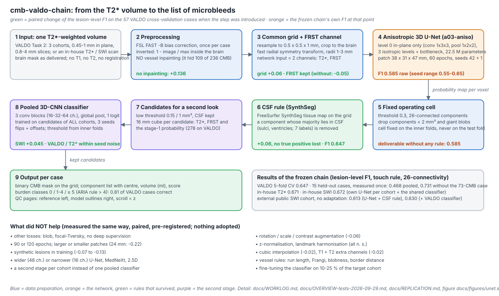
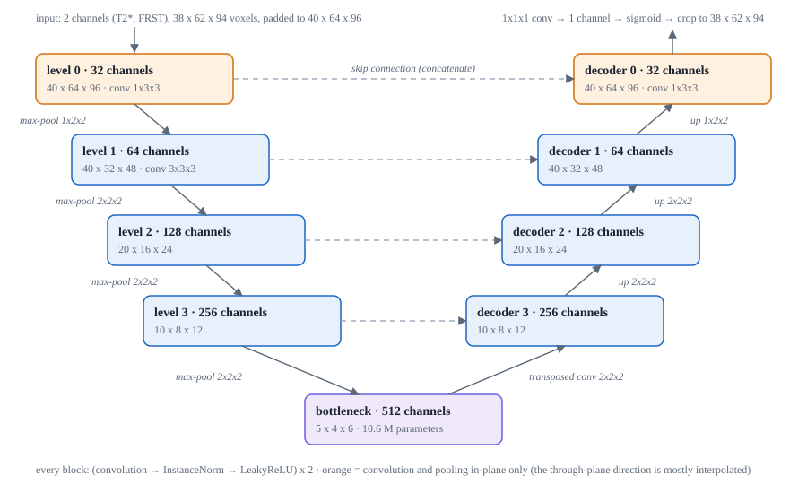

# cmb-valdo-chain: cerebral microbleed detection on T2*/SWI, built from MicrobleedNet by paired ablation

A 3D U-Net detector plus a cross-cohort 3D-CNN candidate classifier for cerebral microbleeds (CMB). It grew out of a
re-implementation of MicrobleedNet on VALDO Task 2 in which every building block was swapped against a paired measurement.
Lesion-level F1 on VALDO 0.245 -> 0.647; in-house clinical cohorts (T2*, SWI) 0.67; an external public SWI cohort without any
adaptation 0.61-0.65. All numbers, decision rules and negative findings: `docs/WORKLOG.md` (the working document),
`docs/OVERVIEW-tests-2026-09-29.md` (every test), `docs/THESIS-CORE.md` (the core for the thesis), `docs/REPLICATION.md`
(the literal command behind every number).

**Traceability.** `docs/TRACEABILITY.md` is the map: every number in the results table traced to its data, the command
that produced it, the result file and the lab-book section; every building block of the chain traced to its source
(paper, original code or own measurement) and to the file that implements it; every data set to its origin and licence.
The bibliography `docs/LITERATURE.md` flags each entry as checked at the source (Q), taken from a research note (R) or
cited from memory (G).

## What is in here
| Folder | Content |
|---|---|
| `cmb/` | the English package: `transfer/` (grids, manifests, zero-shot, evaluation), `stage2/` (candidates, pooled classifier, apply mode), `analysis/` (operating point, ensembles, subject-level F1, candidate shape features, volumes), `review/` (QC pages, slice viewer), `synthesis/`, `baselines/` (MicrobleedNet fine-tune, nnU-Net v2), `experiments/kern.py` (the repeatable core runner) |
| `code/` | training and grid building (grown during the study; identifiers and flags keep their original German names, see the glossary below): `turnier.py` (all training switches), `cv5.py` (5-fold CV core), `netze.py` (architectures, winner `a03-aniso`), `frst.py`, `gitter_c_bauen.py` (0.5×0.5×1 mm grid), `preprocess.py` / `preproc_roh_bauen.py` (VALDO preprocessing), `split.py`, `we5.py --synthseg` (SynthSeg maps), `metric.py` |
| `catalina/` | scripts for an in-house BIDS cohort: `hirn_und_bias.py` (HD-BET + FSL FAST -B once, written to `derivatives/`), `synthseg_swi.sh`, `mb_metrik.py`. No data, no identifiers. |
| `dev/` | VALDO case list with the fixed 5-fold split (`cases.json`, `split.json`, seed 0), manifests, intensity landmarks |
| `docs/` | `TRACEABILITY.md` (the map), `WORKLOG.md` (lab book), `REPLICATION.md` (commands), `OVERVIEW-tests-2026-09-29.md`, `THESIS-CORE.md`, `LITERATURE.md`, `DEVIATIONS-microbleednet.md`, `research/` (notes), frozen environment (`environment/`), VALDO licence |
| `env/` | `environment-from-history.yml` (conda), `requirements-lock.txt` (pip versions of the working environment) |
| `scripts/` | `link_paths.sh` (directory tree) |

## Install
```bash
conda env create -n dl -f env/environment-from-history.yml     # python 3.12
conda activate dl
pip install -r env/requirements-lock.txt                         # torch 2.6.0+cu124, monai 1.5.2, nibabel 5.4.2, scipy 1.18, scikit-image 0.26, nnunetv2 2.8.1
pip install -e /path/to/microbleed-detection                     # the original MicrobleedNet (github.com/v-sundaresan/microbleed-detection), used for FRST and as baseline
bash scripts/link_paths.sh
```
External tools (only for the FIRST preprocessing of a cohort): FSL 6 (`fast -B`), HD-BET (env `medizin`), FreeSurfer 8.2 (`mri_synthseg`). Frozen versions: `docs/environment/`.

## Paths (read this)
The code was written on one machine and uses absolute paths: `ROOT = /home/uchralt/data/work/valdo-t2s` (this repo), `MB = /home/uchralt/data/work/mb-arena`
(private cohort work dir), `EXTERN = /home/uchralt/data/extern/valdo2021/Task2` (VALDO), `~/data/bids/catalina-*` (in-house BIDS).
`scripts/link_paths.sh` creates that tree with symlinks; on another account replace `/home/uchralt` in `cmb/*/*.py` and `code/*.py`
(`grep -rl '/home/uchralt' cmb code catalina`). Moving the constants into one config is on the to-do list.

## Data
**VALDO Task 2** (public, CC BY-NC-SA 4.0): download from https://zenodo.org/records/4520773, unpack to `~/data/extern/valdo2021/Task2/sub-XXX/`
(`*_space-T2S_desc-masked_T2S.nii.gz`, `*_space-T2S_CMB.nii.gz`, T1/T2). Not redistributed here. 72 cases; 15 are held out
(`dev/split.json`, touched once, see WORKLOG.md 5ad) and 57 are the CV cases.

**In-house cohort (catalina, never public)**: BIDS with `sub-XXX/anat/sub-XXX_T2starw.nii.gz` (or `_acq-swi_T2starw`), and derivatives:
```
derivatives/brainmask/sub-XXX/anat/sub-XXX_T2starw_desc-brain_mask.nii.gz      HD-BET (or the scanner's mask)
derivatives/biascorr/sub-XXX/anat/sub-XXX_T2starw_desc-biascorr_T2starw.nii.gz FSL FAST -B on the brain-extracted image
derivatives/manual-cmb/sub-XXX/anat/sub-XXX_..._CMB.nii.gz                      reference masks
```
`catalina/hirn_und_bias.py <swi|t2star>` writes the first two ONCE and skips cases that already have them — HD-BET and bias correction
are never repeated. A case list `faelle.json` (id, fold, image, mask, brain, label paths) drives everything downstream.

## Quality control of the VALDO result
Slice viewer, public: **https://mendeltem.github.io/valdo-cmb-qc/slices/** (two axial images per patient, reference left, model outlines
right, scroll = z, volumes in ml; built by `pipeline/11_qc_viewer.py`). Overview page with per-patient F1 and the pipeline diagram:
https://mendeltem.github.io/valdo-cmb-qc/ . VALDO images only (CC BY-NC-SA 4.0); in-house cohorts are never published.

The viewer (`cmb/review/build_slice_viewer.py`) shows two large axial images per case (reference left, model outlines right),
the lesion F1 per case in the list and the header, the mean and pooled F1 per model at the top of the list; arrow keys
left/right change the case, up/down the slice. For editing the page while looking at it, `python -m cmb.review.live_server OUT_DIR`
serves one or several viewer folders on 127.0.0.1 only, rebuilds the page whenever the generator changes and the page reloads
itself (`--refresh-html` keeps data and images).

## Architecture of the chain



**Stage 1, the detector.** One T2*-weighted volume (no T1, no T2, no registration) is bias-corrected once, inverted so that
microbleeds are bright, and resampled to a common 0.5 x 0.5 x 1 mm grid. The fast radial symmetry transform (radii 1-3 mm) is
computed on that grid and fed as a second channel: it points the network at small round dark spots. The network is an
anisotropic 3D U-Net (`a03-aniso` in `code/netze.py`): its first level convolves and pools only within the slice (kernels 1x3x3,
pooling 1x2x2), because the through-plane direction of the input is mostly interpolated (0.8-4 mm slices); the three deeper
levels and the bottleneck are ordinary isotropic blocks. Every block is (convolution, InstanceNorm, LeakyReLU) twice; channels
32-64-128-256-512, 22.5 M parameters, deep supervision on the decoder, BCE + Dice loss, AdamW, 60 epochs on patches of
38 x 31 x 47 mm sampled 60 % on lesions / 25 % in the brain / 15 % anywhere, flips as the only augmentation. Two seeds (42 and 1)
are averaged. The output is a probability per voxel.



**Fixed operating cell.** Threshold 0.3, 26-connected components, components below 2 mm3 and giant blobs (> 2100 voxels) removed.
The cell was chosen on the inner folds and never on the fold being scored.

**CSF rule.** A FreeSurfer SynthSeg tissue map is resampled to the grid; a component whose majority lies in sulcal or
ventricular CSF is dropped. On VALDO this removes 98 of 176 false positives without losing a true positive (+0.06).

**Stage 2, the candidate classifier.** With a low threshold (0.15, 1 mm3, CSF kept) every suspicious component becomes a
candidate; a 16 mm cube of T2*, FRST and stage-1 probability around it is fed to a small 3D CNN (three blocks 16-32-64 channels,
global average pooling, one logit; three seeds averaged; flips and random offsets). The classifier is trained on the candidates
of all cohorts together, which is what made it work: per-cohort classifiers gained nothing, the pooled one adds +0.045 on SWI
and stays within seed noise on VALDO and T2*. A classifier trained on VALDO candidates alone transfers to in-house SWI without
any private training data (zero-shot 0.671 = pooled 0.672).

**What each step was worth** is written on the figure (paired lesion-level F1 on the 57 VALDO cross-validation cases,
10 000 case bootstraps). The largest single lever was removing the original's vessel inpainting (+0.136): it painted over
109 of the 236 reference microbleeds. Everything that did not help was measured the same way and is listed at the bottom
of the figure and in `docs/OVERVIEW-tests-2026-09-29.md`.

## Pipeline scripts (numbered = order)
```
python pipeline/00_selftest.py              # no data, CPU, < 1 min: imports, FRST, lesion metric, U-Net forward pass, dry run of all steps
python pipeline/01_preprocess.py            # brain mask + FSL FAST -B once per case, then the image without vessel inpainting
python pipeline/02_grid_frst.py             # 0.5 x 0.5 x 1 mm grid + FRST channel
python pipeline/03_synthseg.py              # FreeSurfer SynthSeg tissue maps (CSF rule)
python pipeline/04_manifest.py              # 57 CV cases with folds
python pipeline/05_train_unet.py            # a03-aniso, seeds 42 and 1 (GPU)
python pipeline/06_ensemble_score.py        # ensemble, raw F1, CSF rule -> 0.647
python pipeline/07_candidates.py            # 16-mm candidate cubes for the second stage
python pipeline/08_stage2_classifier.py     # pooled 3D CNN (needs private candidates) / transfer variant
python pipeline/09_external_momeni.py       # external public SWI cohort -> 0.613
python pipeline/10_baseline_microbleednet.py# original MicrobleedNet fine-tuned on the same folds
python pipeline/11_qc_viewer.py             # slice viewer
```
Every script accepts `--dry-run` (print the exact commands), `--force` (repeat a finished step), `--queue` (GPU steps through the job queue)
and `--list` (state of all steps). Steps already finished on disk are skipped; the done-checks live in `cmb/experiments/kern.py`.

## Reproduce (VALDO)
```bash
python -m cmb.experiments.kern --list            # every core step with its done-check; --dry-run prints the exact commands
python code/split.py                             # (only if dev/cases.json is rebuilt) stratified 5 folds, seed 0
python code/preprocess.py --all --out dev/preproc # FSL FAST -B + mask (once); then
python code/preproc_roh_bauen.py                 # inverted image WITHOUT vessel inpainting (+0.136 F1)
GITTER_C_QUELLE=$PWD/dev/preproc_roh GITTER_C_ZIEL=$PWD/dev/gitter_d python code/gitter_c_bauen.py --proc 8   # 0.5x0.5x1 mm + FRST
python code/we5.py --synthseg                    # SynthSeg maps -> dev/synthseg (CSF rule)
python -m cmb.transfer.build_valdo_manifest --grid dev/gitter_d --out dev/manifest_valdo_gitter_d.json
python code/turnier.py --netz a03-aniso --epochen 60 --gitter dev/gitter_d            # baseline, seed 42 (GPU, ~1.6 h)
python code/turnier.py --netz a03-aniso --epochen 60 --gitter dev/gitter_d --seed 1   # second seed
python -m cmb.analysis.ensemble --runs ergebnisse/turnier/a03-aniso-e60-gd ergebnisse/turnier/a03-aniso-s1-e60-gd --out ergebnisse/turnier/ens2-a03-aniso-e60-gd
python -m cmb.analysis.operating_point --run ens2=ergebnisse/turnier/ens2-a03-aniso-e60-gd --manifest dev/manifest_valdo_gitter_d.json --synthseg "dev/synthseg/{id}_synthseg.nii.gz"   # 0.647
python -m cmb.stage2.candidates --predictions ergebnisse/turnier/a03-aniso-e60-gd --grid dev/gitter_d --keep-csf --out ergebnisse/stage2/a03-aniso-e60-gd-weich
```
Every command of every reported number is in `docs/REPLICATION.md`. GPU steps on the original machine went through a queue
(`grossauftrag --vram 20`); elsewhere run them directly. Trainings are deterministic per seed (a01 reproduces cv5-r3 to four digits).

## Reproduce (in-house cohort)
`catalina/hirn_und_bias.py` → `python -m cmb.transfer.build_private_grids --modality t2star|swi` → `catalina/synthseg_*.sh` →
`python code/turnier.py --netz a03-aniso --epochen 60 --manifest <MB>/gitter/manifest_t2star.json --name cat-t2s --basis <MB>/transfer` →
`cmb.stage2.candidates ... --keep-csf` → `cmb.stage2.pooled --cohort valdo=... t2star=... swi=... --models cnn --skip-own --tissue`.
Deployment without private candidates: `python -m cmb.stage2.apply --source ergebnisse/stage2/a03-aniso-e60-gd-weich --target NAME=<candidates>`.

## Results (short)
| Setting | lesion F1 |
|---|---|
| MicrobleedNet re-implementation on VALDO | 0.245 |
| our chain, VALDO 5-fold CV, two-seed ensemble + CSF rule | 0.647 |
| held-out 15 VALDO cases (once) | 0.468 pooled (one case with 73 CMB), 0.731 without it, median per case 0.667 |
| in-house T2* / SWI, own U-Net + shared classifier | 0.671 / 0.672 (fine-tuned original on SWI: 0.406) |
| external public SWI cohort (Momeni/CSIRO), no adaptation | 0.613 (VALDO U-Net + CSF rule), 0.630 (SWI U-Net + VALDO classifier) |
What did NOT help (all measured, paired, pre-registered): loss functions, augmentation, longer training, patch size, intensity harmonisation,
synthetic lesions, second-stage variants, hand-made vessel rules — see `docs/OVERVIEW-tests-2026-09-29.md`.

## Glossary of the legacy identifiers
The scripts in `code/` and `catalina/` were written during the study and keep their original German identifiers, because the exact
commands that produced every reported number use them (`docs/REPLICATION.md`). Comments, help texts and messages are English.

| identifier | meaning | identifier | meaning |
|---|---|---|---|
| `turnier.py`, `--netz` | training runner (tournament), network name | `gitter`, `--gitter` | grid (resampled volume set) |
| `--epochen` | epochs | `falte`, `fold*` | cross-validation fold |
| `bauen` (in file names) | build | `hirn`, `hirnmaske` | brain, brain mask |
| `zusatz`, `--zusatz` | extra input channels (T1, T2) | `landmarken` | intensity landmarks |
| `we5.py --synthseg` | SynthSeg tissue maps (step 5 of the original chain) | `uebermalung` | vessel inpainting |
| `gewebekarte` | tissue map | `rangliste` | ranking table |
| `kohorte`, `faelle` | cohort, cases | `eingaben` | inputs |
| `ergebnisse/` | results | `dev/` | derived data (preprocessing, grids, manifests) |

## Licences
Code: MIT (`LICENSE`). Weights: not in git; VALDO-trained weights CC BY-NC-SA 4.0 (`LICENSE-WEIGHTS.md`). VALDO data: CC BY-NC-SA 4.0, cite
Sudre et al. 2024. Momeni/CSIRO data: CSIRO Data Licence (non-commercial, no redistribution). In-house data: never leaves the clinic.

## English summary
Starting from MicrobleedNet (Sundaresan et al. 2023) re-implemented on VALDO Task 2, every component was replaced one at a time and kept only
if the paired, case-bootstrapped lesion-level F1 improved in 5-fold CV and survived a second seed. Seven changes held: no vessel inpainting,
an anisotropic 3D U-Net, a 0.5×0.5×1 mm grid, the FRST channel, a bounded sampling budget, a SynthSeg CSF rule and a cross-cohort 3D-CNN
candidate classifier. Cohort-specific U-Nets with a VALDO-only classifier transfer without private training data.
